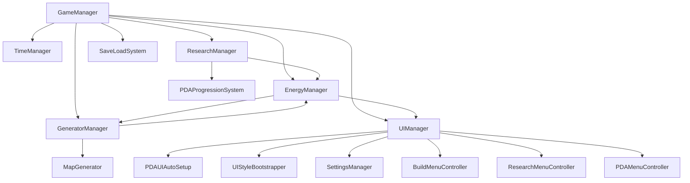

# Green Energy — Project Reference

The player reduces atmospheric CO₂ from 420 ppm to a difficulty-dependent target by placing and upgrading renewable energy generators on a procedurally generated biome map. All core systems are singletons coordinated by `GameManager`.

---

## Table of Contents

- [Architecture Overview](#architecture-overview)
- [Script Directory](#script-directory)
- [How Scripts Link Together](#how-scripts-link-together)
- [Singleton Map](#singleton-map)
- [Dependency Rules](#dependency-rules)
- [UI Design System](#ui-design-system)
- [UI System Reference](#ui-system-reference)
- [Comment Quality Standards](#comment-quality-standards)
- [Maintenance Notes](#maintenance-notes)

---

## Architecture Overview

```
Systems/       core game loop, balance, energy, time, save/load
Gameplay/      map, generators, research, camera control, PDA encyclopedia
UI/            menu controllers and UI setup helpers
Core/          shared theming, animation, styling, notification utilities
Utilities/     small helpers used by multiple systems
```



---

## Script Directory

### Layer 1 — Utilities & Data

| Script | Path | Purpose |
|--------|------|---------|
| `TimeSystemUtils` | `Utilities/TimeSystemUtils.cs` | Static helper; converts `TimeSpeed` enum to a float multiplier (0, 1, 2, 5, 10). Used everywhere that applies speed-scaled `Time.deltaTime`. |
| `DifficultyBalance` | `Systems/DifficultyBalance.cs` | Defines `GameDifficulty` enum, `DifficultyBalanceProfile` value-struct (all balance constants), and `DifficultyBalanceLibrary` (pre-built Easy/Normal/Hard profiles + parse helper). All tuning lives here. The carbon lose threshold is additive: `targetCarbon + carbonLoseThresholdOffset`, not a flat value. |

---

### Layer 2 — Core Systems (Singletons)

| Script | Path | Purpose |
|--------|------|---------|
| `GameManager` | `Systems/GameManager.cs` | Central orchestrator. Owns game-state enum (`MainMenu/Playing/Won/Lost`), carbon level, win/lose logic, and delegates time/energy to `TimeManager`/`EnergyManager`. Builds the effective `DifficultyBalanceProfile` by merging library presets with inspector overrides. Best starting point for tracing game flow. |
| `EnergyManager` | `Systems/EnergyManager.cs` | Tracks `currentEnergy` and `maxEnergyStorage`. Each frame calls `GeneratorManager` for total production, applies speed multiplier, caps at max. Exposes `TryConsumeEnergy()` used by `GeneratorManager` and `ResearchManager`. |
| `TimeManager` | `Systems/TimeManager.cs` | Advances `timeOfDay` (0–1) and `currentDay`. Fires `OnDayChanged` event at midnight. Exposes `SetTimeSpeed()` / `SetGameplayPaused()`. Provides `GetDayNightMultiplier()` (sine curve) for future lighting. |
| `SaveLoadSystem` | `Systems/SaveLoadSystem.cs` | Serialises entire game state to `Application.persistentDataPath/savegame.json` via `JsonUtility`. Collects data from `GameManager`, `GeneratorManager`, `ResearchManager`, and `PDAProgressionSystem`. On load, applies difficulty first then restores each system in dependency order. |

---

### Layer 3 — Gameplay Systems

| Script | Path | Purpose |
|--------|------|---------|
| `MapGenerator` | `Gameplay/MapGenerator.cs` | Generates a 200×100 tile map using seeded Perlin noise (elevation + moisture). Defines `BiomeType` enum (Desert/Plains/Mountain/Water/Coastal/Forest) and `GeneratorType` enum. Exposes `CanPlaceGeneratorType()` and `GetBiomeEfficiencyMultiplier()` for placement validation and output scaling. |
| `Generator` (class) | `Gameplay/GeneratorManager.cs` | Data class for one placed generator. Stores type, tier, position, biome. Computes `baseEnergyOutput` from type × tier × difficulty multiplier. `GetOutput(timeOfDay)` applies solar day-curve, wind/tidal on-off cycles. `UpdateCycles(dt)` advances those cycles. |
| `GeneratorManager` | `Gameplay/GeneratorManager.cs` | Manages the list of placed `Generator` objects. `PlaceGenerator()` checks biome compatibility, tile vacancy, hydro cap (10 max), and energy cost before creating a generator and spawning its prefab. `UpgradeGenerator()` increments tier and recalculates output. Tracks per-type count and fires `PDAProgressionSystem` milestone hooks at 25/50/75/100. |
| `ResearchNode` (class) | `Gameplay/ResearchManager.cs` | One node in the generator tech tree (e.g. "Solar_Tier3"). Costs and times recalculated from `DifficultyBalanceProfile` on demand via `ApplyDifficultyProfile()`. |
| `BatteryNode` (class) | `Gameplay/ResearchManager.cs` | One battery storage tier. Completing it calls `GameManager.AddEnergyStorage()`. Costs scale the same way as `ResearchNode`. |
| `ResearchManager` | `Gameplay/ResearchManager.cs` | Owns 50 generator nodes (5 types × 10 tiers) + 10 battery nodes. `StartResearch()` / `StartBatteryResearch()` validate prerequisites and consume energy. `Update()` advances all in-progress nodes via `UpdateResearchBatch()`. On completion notifies `PDAProgressionSystem`. `ResumeAllActiveResearch()` re-populates active lists after a load. Research costs scale exponentially per tier via `DifficultyBalanceProfile.researchCostMultiplier`. |
| `PDAProgressionSystem` | `Gameplay/PDAProgressionSystem.cs` | In-game encyclopedia. Loads entry definitions from `Resources/PDAEntries.csv` at startup. Entries are unlocked by tier research (`HandleResearchUnlocked`), battery research (`HandleBatteryUnlocked`), or generator milestones (`HandleGeneratorMilestone`). Persists across scene loads via `DontDestroyOnLoad`. Fires `OnProgressionChanged` when any entry unlocks. Use `ExistingInstance` (not `Instance`) in `OnDisable`/cleanup code to avoid unintended creation. |
| `CameraController` | `Gameplay/CameraController.cs` | Orthographic camera. Supports WASD/arrow-key movement, edge-pan (configurable border), middle-mouse drag, scroll-wheel zoom, and hard-clamp to map bounds. Skips edge-pan when mouse is over a UI element. `SetCameraBounds()` should be called after `MapGenerator.GenerateMap()`. |

---

### Layer 4 — UI Core

| Script | Path | Purpose |
|--------|------|---------|
| `UITheme` | `Core/UITheme.cs` | **Single source of truth** for all visual constants: colours (background, text, accent palette), spacing sizes (XSmall–XLarge), and animation durations (Fast/Normal/Slow). Provides `WithAlpha()` and `GetButtonColor()` helpers. Never hardcode colours — always use this. |
| `UIAnimationHelper` | `Core/UIAnimationHelper.cs` | Static coroutine library for all UI motion: fade in/out, slide from edges, button press/hover scale, colour flash, panel open scale. All animations are `IEnumerator`s — call via `StartCoroutine()`. |
| `UIStyleBootstrapper` | `Core/UIStyleBootstrapper.cs` | On `Start()` (or manual `ApplyTheme()` call), walks the canvas hierarchy and bulk-applies `UITheme` colours to Images, Buttons, TextMeshPro, Sliders, and Toggles. |
| `MenuAnimationSetup` | `Core/MenuAnimationSetup.cs` | Lightweight component that ensures a `CanvasGroup` exists on its GameObject, enabling `UIAnimationHelper` fade-in/out on any panel. Added programmatically by `UIManager` to every menu panel. |
| `NotificationSystem` | `Core/NotificationSystem.cs` | Centralized toast notification system. Displays messages in the top-right corner with colour-coded types (cyan=info, green=success, orange=warning, red=error). Auto-dismisses after 3 seconds with slide+fade animations. |

---

### Layer 5 — UI Styling Helpers

| Script | Path | Purpose |
|--------|------|---------|
| `ButtonStyle` | `Core/Styling/ButtonStyle.cs` | Static helpers to apply fully configured button styles (Primary / Secondary / Minimal / Accent / Destructive) in a single call. Also `ConfigureNavigation()` for keyboard focus routing. |
| `PanelStyle` | `Core/Styling/PanelStyle.cs` | Static helpers for panel backgrounds (Dark / Nested / AccentBorder) and layout groups (Vertical / Horizontal / Grid). Also creates divider and spacing objects. |
| `BuildMenuStyler` | `Core/Styling/BuildMenuStyler.cs` | Applies design-system styling to `BuildMenuController`'s panel and buttons, including affordability colour-coding (green = can afford, red = cannot). Added as a component at runtime by `UIManager`. |
| `ResearchMenuStyler` | `Core/Styling/ResearchMenuStyler.cs` | Styles `ResearchMenuController`'s panel and research nodes. Visually distinguishes locked (dimmed 30%), available, researching, and unlocked nodes. |
| `SettingsMenuStyler` | `Core/Styling/SettingsMenuStyler.cs` | Applies theme styling to `SettingsManager`'s panel, including sliders (cyan fill/handle, 36px height) and toggles. Button variant selected by button name. |
| `StatsBarStyler` | `Core/Styling/StatsBarStyler.cs` | Styles the bottom stats bar (cyan energy fill, red carbon fill) and top menu bar buttons (minimal style). Driven by `UIManager`'s field references. |

---

### Layer 6 — UI Controllers

| Script | Path | Purpose |
|--------|------|---------|
| `UIManager` | `UI/UIManager.cs` | Central UI singleton. Owns all top-level panel references and the stats bar. Delegates menu content to specialised controllers. Handles time-speed cycling, menu toggle animations (open/close one at a time, 0.3s fade-in / 0.2s fade-out), and the 10-second game-over auto-return. If UI is broken, inspect here first. |
| `BuildMenuController` | `UI/Menus/BuildMenuController.cs` | Manages build mode. On generator button click, enters build mode and listens for tile clicks to call `GeneratorManager.PlaceGenerator()`. Checks unlock state and affordability before enabling placement. Right-click or Escape cancels. `UpdateDisplay()` is polled by `UIManager.Update()` while open. |
| `ResearchMenuController` | `UI/Menus/ResearchMenuController.cs` | Manages the research panel. `RefreshResearchMenuButtons()` (polled by `UIManager`) updates each type's button text with the next available tier, cost, and in-progress %. Locates buttons by name via `FindButtonRecursive` — buttons must be named `{Type}ResearchButton` (e.g. `SolarResearchButton`) and `BatteryResearchButton`. |
| `SettingsManager` | `UI/Menus/SettingsManager.cs` | Settings panel. Exposes Save / Load / Return to Menu / Delete Save buttons plus difficulty cycling. `UpdateLoadAvailability()` enables/disables the load button based on `SaveLoadSystem.SaveFileExists()`. |
| `PDAMenuController` | `UI/Menus/PDAMenuController.cs` | PDA encyclopedia panel. Builds a scrollable sidebar of category headers and entry buttons from `PDAProgressionSystem`. Locked entries are shown greyed with unlock hints. Subscribes to `OnProgressionChanged` to auto-refresh. UI references can be injected at runtime by `PDAUIAutoSetup` via `Set*` setter methods. |
| `PDAUIAutoSetup` | `UI/PDAUIAutoSetup.cs` | Runtime fallback: builds the full PDA UI hierarchy in code if the scene was not set up with the editor. If all references are already assigned in the Inspector, it just calls `pdaMenuController.Initialize()`. |

---

### Layer 7 — Research Node UI Components

| Script | Path | Purpose |
|--------|------|---------|
| `ResearchNodeUIBase` | `UI/Menus/ResearchNodeUIBase.cs` | Abstract base class for research button widgets. Handles common display logic: label, cost text, progress bar, locked/unlocked/in-progress visual states. Subclasses override `HasNode()`, `IsUnlocked()`, `IsResearching()`, `GetProgress()`, and `OnResearchClicked()`. |
| `ResearchNodeUI` | `UI/Menus/ResearchNodeUI.cs` | Concrete widget for a **generator** research node (e.g. "Wind Tier 3"). `Setup(ResearchNode)` binds the data; clicking triggers `ResearchManager.StartResearch()`. |
| `BatteryNodeUI` | `UI/Menus/BatteryNodeUI.cs` | Concrete widget for a **battery** research node. `Setup(BatteryNode)` binds the data; clicking triggers `ResearchManager.StartBatteryResearch()`. |

---

## How Scripts Link Together

```
┌─────────────────────────────────────────────────────────────┐
│                        GameManager                          │
│  (singleton, owns: carbonLevel, game state, difficulty)     │
│  delegates ──► TimeManager   (day/night, time speed)        │
│  delegates ──► EnergyManager (production, storage)          │
│  reads     ──► DifficultyBalance (profile constants)        │
│  coordinates ► ResearchManager, GeneratorManager,           │
│                SaveLoadSystem, UIManager, MapGenerator       │
└──────────────────────────┬──────────────────────────────────┘
                           │ calls / reads
       ┌───────────────────┼───────────────────────┐
       ▼                   ▼                       ▼
 MapGenerator        GeneratorManager        ResearchManager
 (biome map,         (placed generators,     (tech tree 50+10
  placement rules,    output calc,            nodes, energy
  biome efficiency)   upgrade, milestones)    cost & time)
       │                   │                       │
       │ biome queries      │ TryConsumeEnergy()    │ CompleteResearch()
       │                   ▼                       │
       │             EnergyManager  ◄──────────────┘
       │             (currentEnergy,
       │              maxEnergyStorage)
       │
       │ placement/milestone events
       ▼
 PDAProgressionSystem
 (CSV-driven encyclopedia,
  unlock tracking,
  DontDestroyOnLoad)
       │ OnProgressionChanged
       ▼
 PDAMenuController ◄── UIManager ──► BuildMenuController
                           │         ResearchMenuController
                           │         SettingsManager
                           │
                     Stats bar updates
                     (energy, carbon,
                      day, time speed)
```

### Key Data-Flow Paths

**Energy loop (every frame while Playing):**
`GameManager.Update()` → `EnergyManager.UpdateEnergy()` → `GeneratorManager.GetTotalEnergyProduction(timeOfDay)` → `MapGenerator.GetBiomeEfficiencyMultiplier()` → result capped at `maxEnergyStorage` → `UIManager.UpdateEnergyDisplay()`

**Carbon reduction loop (every frame while Playing):**
`GameManager.UpdateCarbonLevel()` reads `GeneratorManager.GetTotalEnergyProduction(0.5f)` × `DifficultyBalanceProfile.carbonReductionMultiplier` → subtracts from `carbonLevel` → adds penalty if below underproduction threshold → `UIManager.UpdateCarbonDisplay()`

**Research flow:**
Player clicks button in `ResearchMenuController` → `ResearchManager.StartResearch(nodeId)` → deducts energy via `GameManager.TryConsumeEnergy()` → node added to `activeResearchNodes` → each frame `ResearchManager.Update()` advances progress → on completion `CompleteResearch()` notifies `PDAProgressionSystem.HandleResearchUnlocked()` → `PDAProgressionSystem` fires `OnProgressionChanged` → `PDAMenuController` refreshes display

**Placement flow:**
Player selects generator in `BuildMenuController` → clicks map tile → `GeneratorManager.PlaceGenerator()` validates biome (`MapGenerator.CanPlaceGeneratorType()`), checks vacancy + hydro cap, deducts energy (`GameManager.TryConsumeEnergy()`) → creates `Generator`, spawns prefab, increments milestone counters → at 25/50/75/100 notifies `PDAProgressionSystem.HandleGeneratorMilestone()`

**Save flow:**
`GameManager.SaveGame()` → `SaveLoadSystem.SaveGame()` collects state from `GameManager`, `GeneratorManager`, `ResearchManager`, `PDAProgressionSystem` → `JsonUtility.ToJson` → writes `savegame.json`

**Load flow:**
`GameManager.LoadSavedGameFromMenu()` → `InitializeGame(false)` → `SaveLoadSystem.LoadGame()` → `ApplyLoadedData()` restores in order: difficulty → game state → map (same seed) → generators → research nodes → PDA unlocks → `GameManager.ApplyDifficultyToSystems()`

**Difficulty propagation:**
`GameManager.SetDifficulty()` → `ApplyDifficultyToSystems()` → pushes `CurrentDifficultyProfile` to `ResearchManager.ApplyDifficultyProfile()`, `GeneratorManager.ApplyDifficultyProfile()`, and triggers `UIManager.RefreshAllDisplays()`

**UI styling flow (scene load):**
`UIManager.Start()` → `UIStyleBootstrapper.ApplyTheme()` (bulk colours) → `ApplyMenuStyling()` adds `StatsBarStyler`, `BuildMenuStyler`, `ResearchMenuStyler`, `SettingsMenuStyler` components and calls their `Apply*Styling()` methods, all using `UITheme` constants via `ButtonStyle` and `PanelStyle` helpers

---

## Singleton Map

| Singleton | How obtained |
|-----------|-------------|
| `GameManager.Instance` | `Awake()` sets self |
| `UIManager.Instance` | `Awake()` sets self |
| `GeneratorManager.Instance` | `Awake()` sets self |
| `ResearchManager.Instance` | `Awake()` sets self |
| `SaveLoadSystem.Instance` | `Awake()` sets self |
| `PDAProgressionSystem.Instance` | Lazy: creates a new GameObject if needed (safe in play mode only) |

`GameManager` caches missing references in `CacheMissingReferences()` (called on `Start()` and before every public entry point). `EnergyManager` and `TimeManager` are components on the same GameObject as `GameManager`, created on demand if not assigned in the Inspector.

---

## Dependency Rules

- **Utilities / Data** (`TimeSystemUtils`, `DifficultyBalance`) — no dependencies; called by everything.
- **Core Systems** — call each other via singleton accessors; never call UI directly except through `UIManager`.
- **Gameplay Systems** — call Core Systems and can call `PDAProgressionSystem`.
- **UI** — reads from all layers; never owns game-logic state; pushes changes back through `GameManager` public methods.
- **Stylers** — depend only on `UITheme`, `ButtonStyle`, `PanelStyle`; no game-logic dependencies.

---

## UI Design System

### Color Palette

| Role | Hex | Usage |
|------|-----|-------|
| Background Dark | `#1a1a1a` | Main UI background |
| Background Medium | `#262626` | Panel backgrounds, buttons |
| Background Light | `#333333` | Hover states, secondary elements |
| Text Primary | `#f2f2f2` | Main text (95% white) |
| Text Secondary | `#b3b3b3` | Muted / disabled text |
| Accent Cyan | `#00d9ff` | Energy, active states, primary highlight |
| Accent Green | `#1ae664` | Success, progress, completion |
| Accent Red | `#f24c4c` | Warnings, errors, destructive actions |
| Accent Orange | `#ff9919` | Alerts, secondary actions |
| Border Dark | `#4d4d4d` | Subtle dividers (30% gray) |
| Button Normal | `#262626` | Standard button background |
| Button Hover | `#404040` | Button hover state |

All values are available as constants in `UITheme.cs`.

### Typography

| Level | Size | Weight | Colour |
|-------|------|--------|--------|
| Title/Header | 36px | Bold | Primary White |
| Subheader | 28px | Bold | Primary White |
| Body Text | 24px | Regular | Primary White |
| Small/Caption | 18px | Regular | Secondary Gray |
| Button Text | 32px | Bold | Primary White |

Font: TextMeshPro default.

### Spacing

| Name | Value | Use |
|------|-------|-----|
| XSmall | 4px | Tight spacing |
| Small | 8px | Compact padding, list gaps |
| Medium | 16px | Standard padding (panels) |
| Large | 24px | Section separators |
| XLarge | 32px | Major section breaks |

### Animation Timings

| Speed | Duration | Use |
|-------|----------|-----|
| Fast | 0.15s | Button press feedback, notifications |
| Normal | 0.3s | Menu open / transitions |
| Slow | 0.5s | Reserved for future use |

Available as `UITheme.AnimationFastDuration`, `UITheme.AnimationNormalDuration`, `UITheme.AnimationSlowDuration`.

### Button Variants

| Variant | Text Colour | Use |
|---------|-------------|-----|
| Primary | White | Main actions, standard buttons |
| Secondary | White | Less prominent actions |
| Minimal | White | Icon-like, menu bar |
| Accent | Green (`#1ae664`) | Success / confirm actions |
| Destructive | Red (`#f24c4c`) | Delete / irreversible actions |

### Panel Variants

| Variant | Background | Border |
|---------|------------|--------|
| Dark | `#262626` | 1px `#4d4d4d` |
| Nested | `#1a1a1a` | 1px `#4d4d4d` |
| Accent Border | `#262626` | 2px `#00d9ff` cyan |

---

## UI System Reference

### UITheme — code usage

```csharp
Color bg      = UITheme.ColorBackgroundDark;       // #1a1a1a
Color text    = UITheme.ColorTextPrimary;           // #f2f2f2
Color cyan    = UITheme.ColorAccentCyan;            // #00d9ff
float pad     = UITheme.SpacingMedium;              // 16px
float dur     = UITheme.AnimationNormalDuration;    // 0.3s
Color faded   = UITheme.WithAlpha(cyan, 0.5f);
Color btnClr  = UITheme.GetButtonColor(isHover: true, isPressed: false);
```

### ButtonStyle — applying styles

```csharp
ButtonStyle.ApplyPrimaryStyle(button, "Click Me");
ButtonStyle.ApplySecondaryStyle(button, "Optional");
ButtonStyle.ApplyMinimalStyle(button, "☰");
ButtonStyle.ApplyAccentStyle(button, "Continue", UITheme.ColorAccentGreen);
ButtonStyle.ApplyDestructiveStyle(button, "Delete Save");
ButtonStyle.ConfigureNavigation(button, upButton: btn1, downButton: btn2);
```

### PanelStyle — applying styles

```csharp
PanelStyle.ApplyDarkPanelStyle(panelImage);
PanelStyle.ApplyNestedPanelStyle(panelImage);
PanelStyle.ApplyAccentBorderPanelStyle(panelImage, UITheme.ColorAccentCyan);
PanelStyle.ConfigureVerticalLayout(verticalLayoutGroup);
PanelStyle.ConfigureHorizontalLayout(horizontalLayoutGroup);
PanelStyle.ConfigureGridLayout(gridLayoutGroup, columnCount: 3, cellHeight: 60f);
PanelStyle.AddDivider(parentTransform);
PanelStyle.AddSpacing(parentTransform, 16f);
```

### UIAnimationHelper — animations

All methods are `IEnumerator`s — wrap in `StartCoroutine()`.

```csharp
// Menu transitions
StartCoroutine(UIAnimationHelper.AnimateMenuAppear(canvasGroup, 0.3f));
StartCoroutine(UIAnimationHelper.AnimateMenuDisappear(canvasGroup, 0.2f));
StartCoroutine(UIAnimationHelper.AnimateSlideInFromLeft(rect, panelWidth: 400f, duration: 0.3f));
StartCoroutine(UIAnimationHelper.AnimateSlideInFromRight(rect, slideDistance: 20f, duration: 0.2f));

// Button feedback
StartCoroutine(UIAnimationHelper.AnimateButtonPress(btnRect));
StartCoroutine(UIAnimationHelper.AnimateButtonHover(btnRect, isHovering: true));
StartCoroutine(UIAnimationHelper.AnimatePulse(rect, pulseScale: 1.1f, pulseCount: 2));

// Colour
StartCoroutine(UIAnimationHelper.AnimateColorFlash(image, UITheme.ColorAccentCyan, 0.2f));
StartCoroutine(UIAnimationHelper.AnimateColorChange(image, UITheme.ColorAccentGreen, 0.3f));

// Panel
StartCoroutine(UIAnimationHelper.AnimatePanelOpen(panelRect, 0.3f));
```

### NotificationSystem

```csharp
NotificationSystem.Instance.ShowSuccess("Energy generated!");
NotificationSystem.Instance.ShowError("Not enough energy");
NotificationSystem.Instance.ShowWarning("Carbon rising!");
NotificationSystem.Instance.ShowInfo("New entry unlocked");
NotificationSystem.Instance.Show("Custom message", UITheme.ColorAccentCyan, duration: 4f);
```

Notifications appear top-right, slide in from the right (0.15s), stay for 3 seconds, then slide out. Multiple notifications queue properly.

### Common Patterns

**Styled menu panel:**
```csharp
public void Initialize()
{
    PanelStyle.ApplyDarkPanelStyle(menuPanel.GetComponent<Image>());
    PanelStyle.ConfigureVerticalLayout(menuPanel.GetComponent<VerticalLayoutGroup>());
    foreach (Button btn in menuPanel.GetComponentsInChildren<Button>())
        ButtonStyle.ApplyPrimaryStyle(btn);
}
```

**Animated menu toggle:**
```csharp
private IEnumerator OpenMenuAnimated()
{
    menuPanel.SetActive(true);
    yield return StartCoroutine(UIAnimationHelper.AnimateMenuAppear(
        menuPanel.GetComponent<CanvasGroup>(), UITheme.AnimationNormalDuration));
}

private IEnumerator CloseMenuAnimated()
{
    yield return StartCoroutine(UIAnimationHelper.AnimateMenuDisappear(
        menuPanel.GetComponent<CanvasGroup>()));
    menuPanel.SetActive(false);
}
```

---

## Comment Format

Used across all scripts:

1. **Class-level `/// <summary>`** — one paragraph explaining what the class owns and its role in the system.
2. **Public method docs** — all public methods have `/// <summary>` + `/// <param>` + `/// <returns>` where applicable, including Unity messages (`Awake`, `Start`, `Update`) when non-trivial.
3. **`/// <inheritdoc/>`** — override methods in `ResearchNodeUI` and `BatteryNodeUI` use this to inherit base class docs without duplication.
4. **Section headers** — `// ===== SECTION NAME =====` for logical groupings within a class.
5. **Inline comments** — explain *why*, not *what*; used for non-obvious constants, formulae, or conditional branches (e.g. biome Perlin thresholds, carbon reduction formula, cost scaling).
6. **No comment on self-evident one-liners** — single property getters, null guards, and obvious delegate hookups do not need comments.

---

## Maintenance Notes

- `GameManager`, `UIManager`, `SaveLoadSystem`, `TimeManager`, `EnergyManager`, `ResearchManager`, `GeneratorManager`, and `PDAProgressionSystem` are the key runtime singletons.
- `DifficultyBalance` is the main source of tuning values; `GameManager` can override some effective values through serialized fields — use `GameManager.Instance.CurrentDifficultyProfile` at runtime so inspector overrides are respected.
- The UI is driven by setup and styling helpers; if a menu looks wrong, inspect both the controller and the corresponding styler.
- The PDA system depends on CSV content in `Resources/PDAEntries.csv`; content or unlock rule changes need to be reflected in both the data and the save system.
- `ResearchMenuController` finds buttons by name — they must follow the `{Type}ResearchButton` convention (e.g. `SolarResearchButton`).
- `PDAProgressionSystem.Instance` lazily creates a GameObject if accessed when none exists. Use `ExistingInstance` in cleanup/`OnDisable` code to avoid unintended creation.
